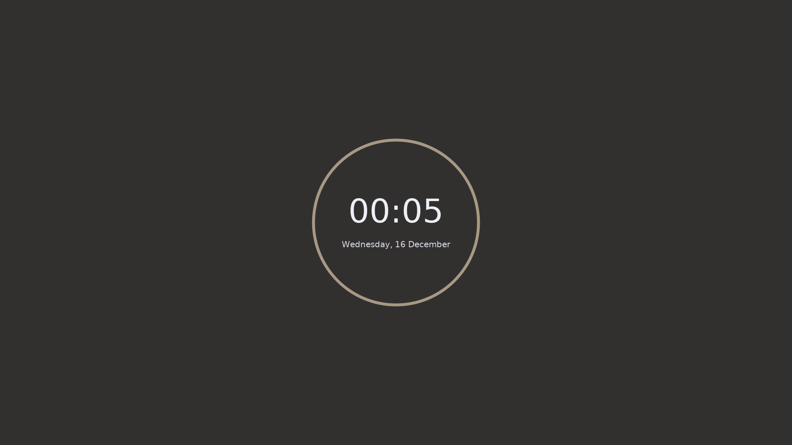

```
▒█▀▀▄ ▒█▀▀▀█ ▀▀█▀▀ ▒█▀▀▀ ▀█▀ ▒█░░░ ▒█▀▀▀ ▒█▀▀▀█
▒█░▒█ ▒█░░▒█ ░▒█░░ ▒█▀▀▀ ▒█░ ▒█░░░ ▒█▀▀▀ ░▀▀▀▄▄
▒█▄▄▀ ▒█▄▄▄█ ░▒█░░ ▒█░░░ ▄█▄ ▒█▄▄█ ▒█▄▄▄ ▒█▄▄▄█
```

| Program                             | Name                                                                                           |
| :---                                | :---                                                                                           |
| Linux Distribution                  | [Arch Linux](https://www.archlinux.org/)                                                       |
| Window Manager                      | [bspwm](https://github.com/baskerville/bspwm)                                                  |
| Bar                                 | [polybar](https://github.com/jaagr/polybar)                                                    |
| Program Launcher                    | [rofi](https://github.com/DaveDavenport/rofi)                                                  |
| Wallpaper Setter                    | [feh](https://github.com/derf/feh)                                                             |
| Web Browser                         | [Firefox](https://www.mozilla.org/en-US/firefox/)                                              |
| Icon theme                          | [Papirus](https://github.com/PapirusDevelopmentTeam/papirus-icon-theme)                        |
| Text editors/IDE's and Gtk/Qt theme | [Gruvbox](https://github.com/morhetz/gruvbox)                                                  |
| Code Editor                         | [Nvim](https://neovim.io/)                                                                     |
| Text editors/Terminal font          | [Victor Mono](https://rubjo.github.io/victor-mono/)                                            |
| Shell                               | [zsh](https://www.zsh.org/)                                                                    |
| Terminal Emulator                   | [Kitty](https://sw.kovidgoyal.net/kitty/)                                                      |
| Document Viewer                     | [Zathura](https://pwmt.org/projects/zathura/)                                                  |
| Music Player                        | [ncmpcpp/mpd](https://github.com/ncmpcpp/ncmpcpp)                                              |

# [Screenshots]

## Home


## Code Editor


## Windows - Tiled


## Windows - Floating


## Discord CSS


## Lockscreen


# [Wallpaper]

