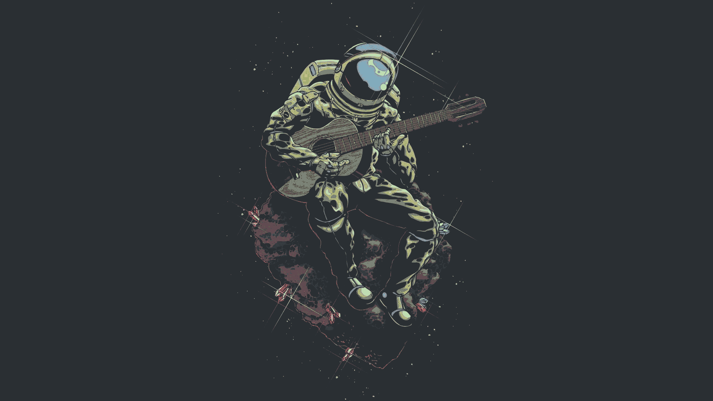

---

These are the dots I use on my linux machine. I update my setup according to my feels and needs. The major checkpoints are present in git branches. Do check them if you will ;D

| Program                             | Name                                                                                                                           |
| :---                                | :---                                                                                                                           |
| Linux Distribution                  | [Arch Linux](https://www.archlinux.org/)                                                                                       |
| Window Manager                      | [bspwm](https://github.com/baskerville/bspwm)                                                                                  |
| Bar                                 | [polybar](https://github.com/jaagr/polybar)                                                                                    |
| Program Launcher                    | [rofi](https://github.com/DaveDavenport/rofi)                                                                                  |
| Wallpaper Setter                    | [feh](https://github.com/derf/feh)                                                                                             |
| Web Browser                         | [Firefox](https://firefox.com)                                                                                                 |
| Icon theme                          | [Flatery](https://www.pling.com/p/1332404)                                                                                     |
| Text editors/IDE's and Gtk/Qt theme | [Serenade](https://github.com/b4skyx/serenade)                                                                                 |
| Code Editor                         | [Nvim](https://neovim.io/)                                                                                                     |
| Text editors/Terminal font          | [Sarasa](https://github.com/be5invis/Sarasa-Gothic)                                                                            |
| Shell                               | [zsh](https://www.zsh.org/)                                                                                                    |
| Terminal Emulator                   | [st](https://st.suckless.org/)                                                                                                 |
| Document Viewer                     | [Zathura](https://pwmt.org/projects/zathura/)                                                                                  |
| Music Player                        | [ncmpcpp/mpd](https://github.com/ncmpcpp/ncmpcpp)                                                                              |
| GTK Theme                           | [Serenade (Oomox Generated)](https://cdn.discordapp.com/attachments/792698625011482677/813491937041448970/serenade.zip)                                                      |
| Lockscreen                          | [i3lock-color(v2.13c2+)](https://github.com/Raymo111/i3lock-color)                                                                                                                  |

## Installation

I suggest you to go through configs and cherrypick what you need. Might be time consuming, but will provide you a setup you're happy with.

Though if you simply wish to clone my setup on your machine, first step is to install the applications I use on your distro. The major ones are listed above.

Then run the following in your terminal

```sh
bash <(curl -s https://raw.githubusercontent.com/b4skyx/dotfiles/master/install.sh)
```

This will _backup your existing configs_ and setup mine.<br>

---

Paths to check alongside the dots repo:
- [Scripts](https://github.com/b4skyx/unix-scripts): The scripts I use along with my dots
- [Serenade](https://github.com/b4skyx/serenade): Colorscheme
- [Discord Theme](https://github.com/b4skyx/discord-serenade)
- [Gtk Theme](https://cdn.discordapp.com/attachments/792698625011482677/813491937041448970/serenade.zip)
- [Vim Config]()

---

## Preview

#### Home


#### Floating


#### Neovim/Rofi


#### Busy Tiled


#### Locksceen


## Wallpaper

